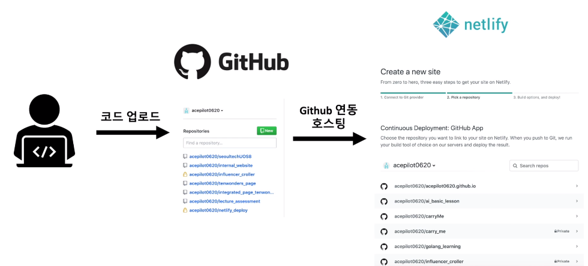

# Netlify 배포

## 정적 페이지와 동적페이지

🤍 정적 페이지(Static page) 
시간의 흐름과 사용자의 요청에 상관없이 변화하지 않는 페이지 
  -> html, css, js, img
 

🤍 동적 페이지(Dynamic page) 
시간의 흐름과 사용자의 요청에 변화하는 페이지 
  -> 앞단의 html, css, js와 뒷단에서 기능 구현하는 django, DB가 상호작용하면서 달라진다.

# Netlify 배포과정

  
* hosting이란 내 코드를 서버에 올려서 internet에 접근할 수 있게하는 것  

   

   

   
자기소개 page나 이력서 page를 AWS를 통해 배포할 필요없이 github에 올려서 Netlify로 배포할 수 있습니다 
그리고 url을 보내서 친구들에게 자랑할 수 있지요 ^^ 
하지만 Netlify는 정적 페이지만 배포할 수 있기 때문에 한계가 있습니다. 

